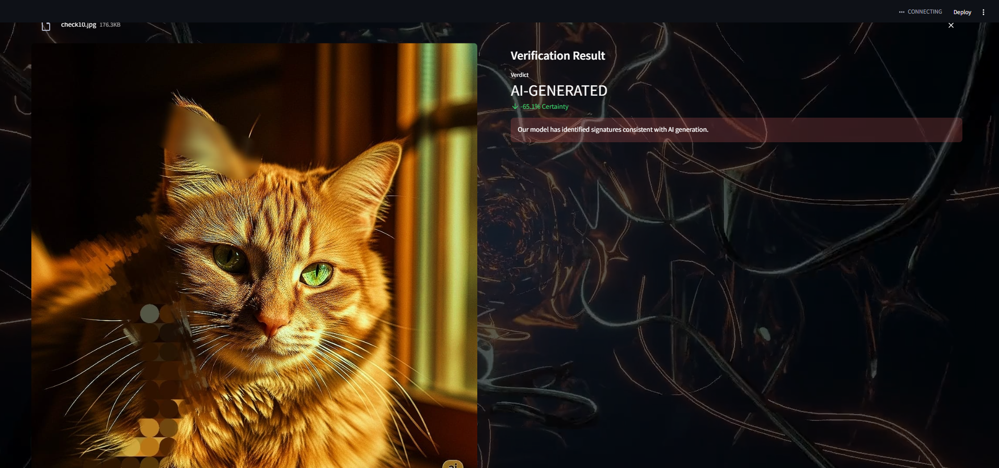

# AI Authenticity Detector 🛡️

[View Live Demo](https://your-live-app-url.streamlit.app)   •   [View on GitHub](https://github.com/vijayakrishnachethula/ai-authenticity-detector-)

---

This is a full-stack web application built to determine the authenticity of digital images. It leverages a powerful deep learning model to classify an image as either a real photograph or a synthetic image generated by state-of-the-art AI.



## ✨ Core Features

- **Advanced AI Detection:** Utilizes a Convolutional Neural Network (CNN) built with **Transfer Learning (MobileNetV2)** to achieve high accuracy on a challenging, modern dataset.
- **Interactive & Beautiful UI:** Engineered with Streamlit, featuring a dynamic video background and a "glassmorphism" design for a polished, professional user experience.
- **Versatile File Handling:** Accepts standard image formats (`.jpg`, `.png`, `.jpeg`) as well as `.pdf` documents, automatically extracting and analyzing images from the PDF.
- **Real-Time Analysis:** Provides instant feedback with a verdict (`REAL` or `AI-GENERATED`) and a confidence score for each uploaded file.

## 🛠️ Technology Stack

| Category | Technology |
| :--- | :--- |
| **Backend & Core Logic** | Python |
| **AI / Deep Learning** | TensorFlow, Keras |
| **Web Framework** | Streamlit |
| **Data Handling** | NumPy, Pillow (PIL) |
| **PDF Processing**| PyMuPDF |
| **Version Control**| Git, Git LFS |


## 🚀 Running the Project Locally

To run this application on your local machine, follow these steps:

1.  **Clone the repository:**
    ```bash
    git clone https://github.com/vijayakrishnachethula/ai-authenticity-detector-.git
    ```
2.  **Navigate to the project directory:**
    ```bash
    cd ai-authenticity-detector-
    ```
3.  **Install the required libraries:**
    *It is recommended to use a virtual environment.*
    ```bash
    pip install -r requirements.txt
    ```
4.  **Run the Streamlit app:**
    ```bash
    streamlit run app.py
    ```
The application will then be accessible in your web browser.

## 📈 Model Performance & Development

The project involved an iterative development process to combat overfitting and improve generalization on a challenging dataset of high-fidelity AI images (from Midjourney v6).

The final model (`authenticator_v3_pro.h5`) was developed using **Transfer Learning** and **Data Augmentation**, achieving the following performance on the unseen validation set:

- **Validation Accuracy:** **73.33%**
- **Validation Loss:** **0.4823**

This result demonstrates a significant improvement over a baseline CNN and shows effective mitigation of overfitting, a key challenge with this advanced dataset.

---
*This project was created by C Vijaya krishna Chethula.*
